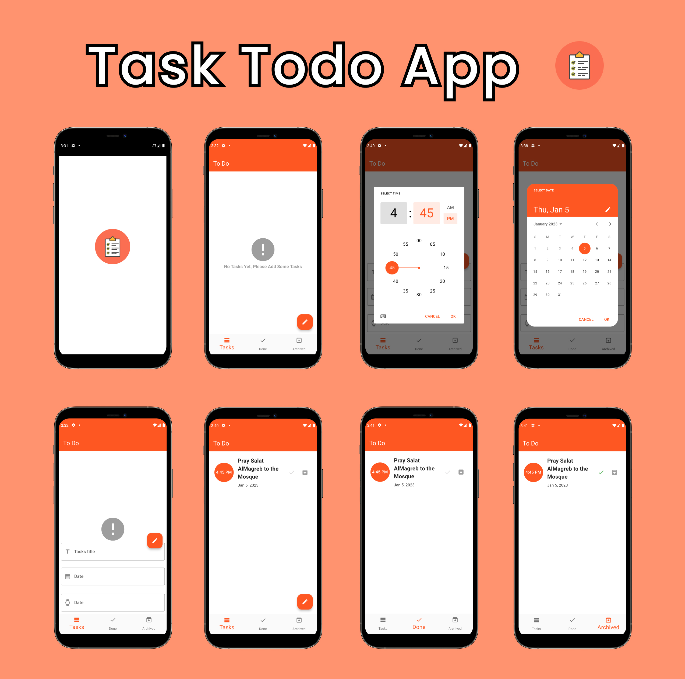
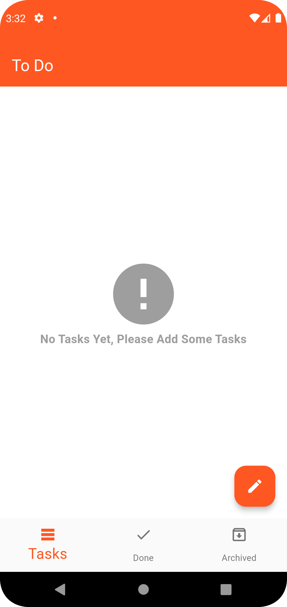
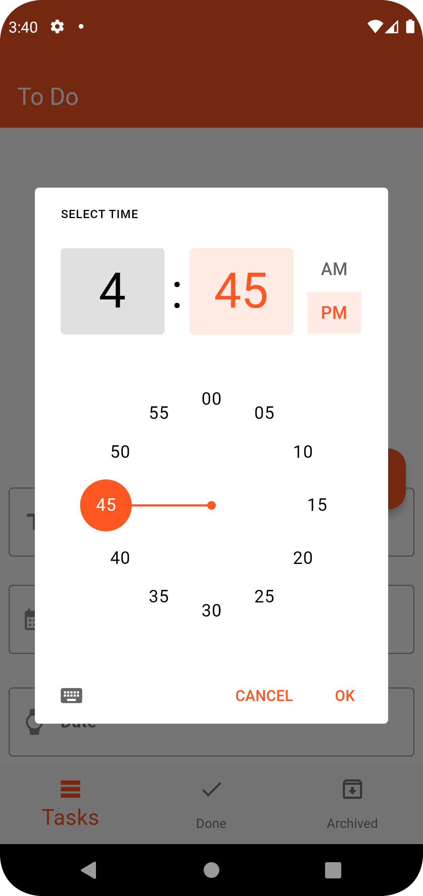
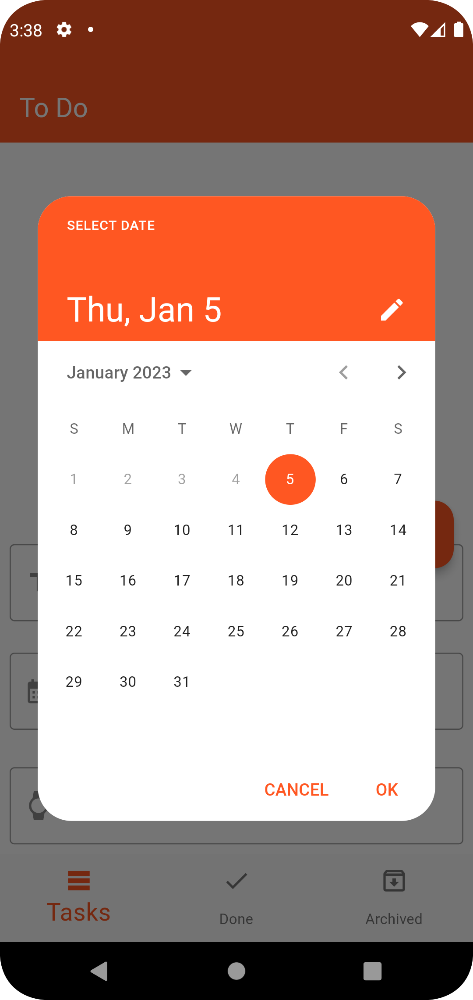
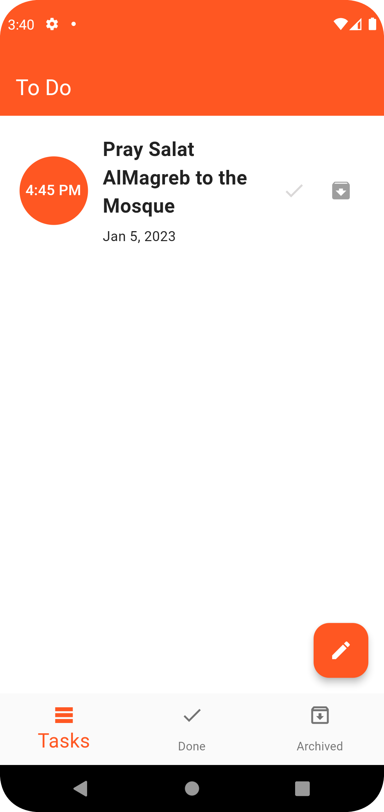
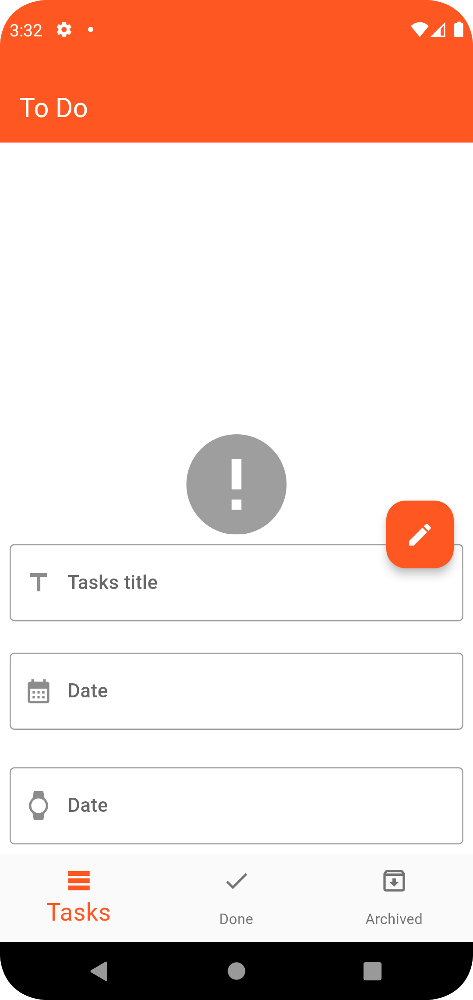
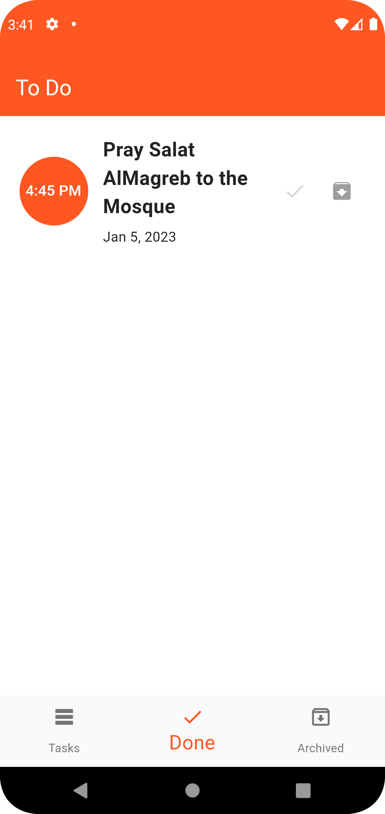
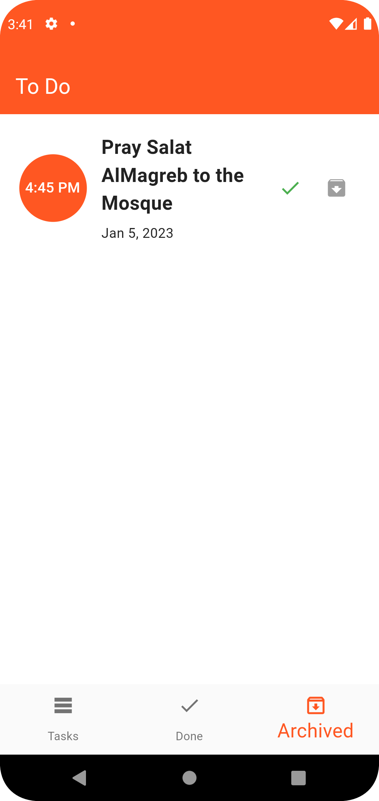

# ToDo App
## Getting Started
This is a simple app for writing today's tasks and future tasks using Sqlite DB to done all operations for (CRUD)

## Plugins
- Splash Screen "package"
- Sqlite "package"
- BLoC & Cubit "package"
- Material3
- Add Calender
- Add Timer

## How to use this app
- You can install application in your device via this repo
```bash
  git clone https://github.com/klilmhdi/todo_app_sqlite.git
cd todo_app_sqlite
flutter pub get
flutter run
```

Watch for this screens about my application


<br>

<br>

<br>

<br>

<br>

<br>

<br>

<br>
